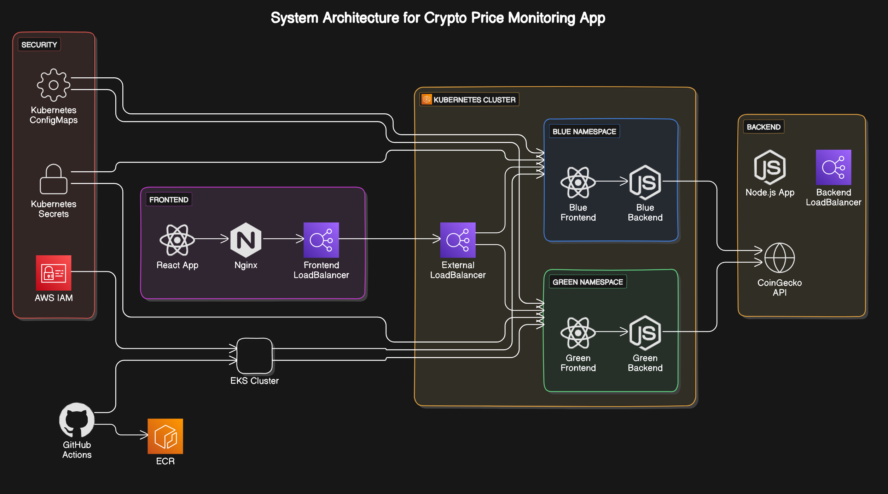
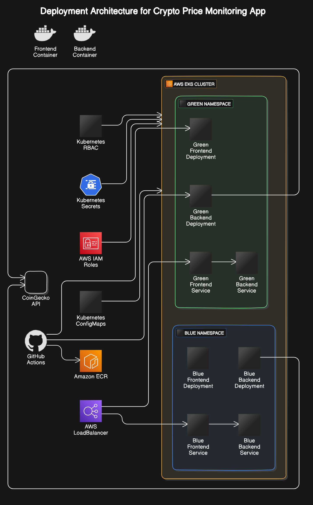
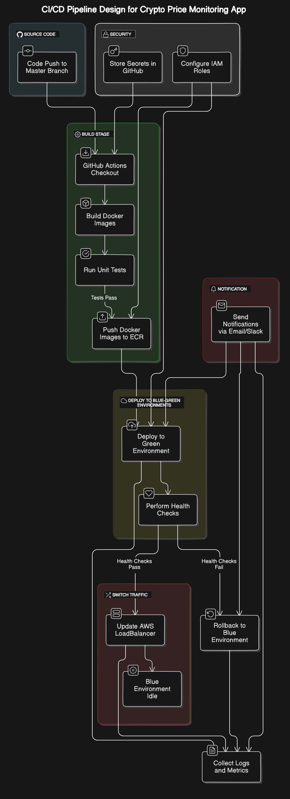

# Crypto Price Monitoring App

This repository contains the source code and deployment configurations for the **Crypto Price Monitoring Application**, a containerized application that displays real-time cryptocurrency prices using data from the CoinGecko API. It features a **React-based frontend** and a **Node.js backend** deployed on **AWS EKS** using a **blue-green deployment** strategy, with an automated CI/CD pipeline powered by **GitHub Actions**.

---

## Table of Contents
1. [System Architecture](#system-architecture)
2. [Deployment Architecture](#deployment-architecture)
3. [CI/CD Pipeline](#cicd-pipeline)
4. [RunBook](#runbook)
5. [Setup Guide](#setup-guide)
6. [Contributing](#contributing)
7. [License](#license)

---

## System Architecture

The system is based on a microservices architecture, with separate containers for the **frontend** and **backend** components. The application runs on an **AWS EKS cluster** using Kubernetes for orchestration and scaling. Below is a high-level system architecture diagram:



### Components:
- **Frontend**: Built with React, Vite, and Tailwind CSS, deployed as a Docker container.
- **Backend**: A Node.js and Express service that fetches real-time crypto prices from the CoinGecko API.
- **AWS EKS**: The Kubernetes cluster running both the frontend and backend services, deployed using blue-green deployment for zero downtime updates.
- **GitHub Actions**: Automates the CI/CD pipeline for building, testing, and deploying the application.

---

## Deployment Architecture

The deployment uses **AWS EKS** with blue-green deployment to ensure continuous uptime during updates. New versions of the app are deployed to a **green environment**, while the current version runs in the **blue environment**. Traffic is switched between blue and green after validation.



### Key Features:
- **Kubernetes Cluster on AWS EKS**: Hosts the containers for both frontend and backend.
- **Blue-Green Deployment**: Ensures no downtime during updates by switching traffic between the blue and green environments.
- **Load Balancing**: AWS LoadBalancer handles incoming traffic, switching to the green environment once the new version is verified.

---

## CI/CD Pipeline

This project uses **GitHub Actions** to automate the CI/CD process, which includes building the Docker images, running tests, and deploying to AWS EKS. The pipeline deploys the new version to the **green namespace** first and switches traffic to it after passing health checks.



### Pipeline Steps:
1. **Checkout Code**: Retrieves the latest code from the repository.
2. **Build Docker Images**: Builds separate images for the frontend and backend.
3. **Push to ECR**: Pushes the images to **Amazon Elastic Container Registry (ECR)**.
4. **Deploy to EKS (Green Environment)**: Deploys the new version to the green environment.
5. **Run Health Checks**: Ensures the new version is stable.
6. **Switch Traffic**: Switches traffic from the blue environment to the green environment.
7. **Monitoring**: Monitors deployment success using AWS CloudWatch.

---

## RunBook

The **RunBook** provides detailed steps for deploying, monitoring, and managing the application. Below is a summary of the steps:

1. **Build the Docker Images**.
2. **Push Docker Images to ECR**.
3. **Deploy to the Green Environment**.
4. **Run Health Checks** on the green environment.
5. **Switch Traffic** to the green environment.
6. **Monitor Deployment** via AWS CloudWatch.
7. **Rollback** if necessary.
8. **Clean Up** the blue environment once the green environment is stable.

For detailed instructions, see the full RunBook [here](assets/runbook.png).

---

## Setup Guide

Follow these steps to set up and deploy the application to AWS EKS.

### Pre-requisites:
- **AWS Account**: Ensure you have an AWS account and have configured AWS CLI or eksctl.
- **Docker**: Ensure Docker is installed on your machine.
- **AWS EKS**: An EKS cluster running in your AWS account.
- **GitHub Secrets**: Store AWS credentials (`AWS_ACCESS_KEY_ID`, `AWS_SECRET_ACCESS_KEY`) as GitHub secrets for GitHub Actions.

### Steps:
1. **Clone the repository**:
    ```bash
    git clone https://github.com/your-username/crypto-price.git
    cd crypto-price
    ```

2. **Build the Docker images**:
    ```bash
    docker build -t crypto-frontend-backend .
    ```

3. **Push the images to ECR**:
    ```bash
    docker tag crypto-frontend-backend:latest <aws_account_id>.dkr.ecr.<region>.amazonaws.com/crypto-price:latest
    docker push <aws_account_id>.dkr.ecr.<region>.amazonaws.com/crypto-price:latest
    ```

4. **Deploy to the green environment in EKS**:
    ```bash
    kubectl apply -f deployment.yaml --namespace=green
    ```

5. **Switch traffic** after verifying the green environment:
    ```bash
    kubectl apply -f service.yaml --namespace=green
    ```

---

## Contributing

We welcome contributions to this project. Please create a pull request for any improvements or new features.

---

## License

This project is licensed under the MIT License. See the [LICENSE](LICENSE) file for details.

---

